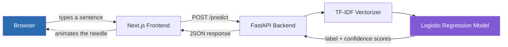
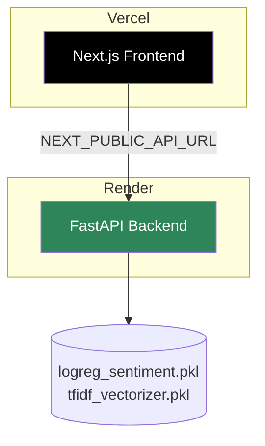

## Architecture

```mermaid
flowchart LR
    A[Browser] -->|types a sentence| B[Next.js Frontend]
    B -->|POST /predict| C[FastAPI Backend]
    C --> D[TF-IDF Vectorizer]
    D --> E[Logistic Regression Model]
    E -->|label + confidence scores| C
    C -->|JSON response| B
    B -->|animates the needle| A

    style A fill:#2b6cb0,color:#fff
    style E fill:#805ad5,color:#fff
```

**Deployment topology:**

```mermaid
flowchart TD
    subgraph Vercel
        F[Next.js Frontend]
    end
    subgraph Render
        G[FastAPI Backend]
    end
    F -->|NEXT_PUBLIC_API_URL| G
    G --> H[(logreg_sentiment.pkl\ntfidf_vectorizer.pkl)]

    style F fill:#000,color:#fff
    style G fill:#2f855a,color:#fff
```
